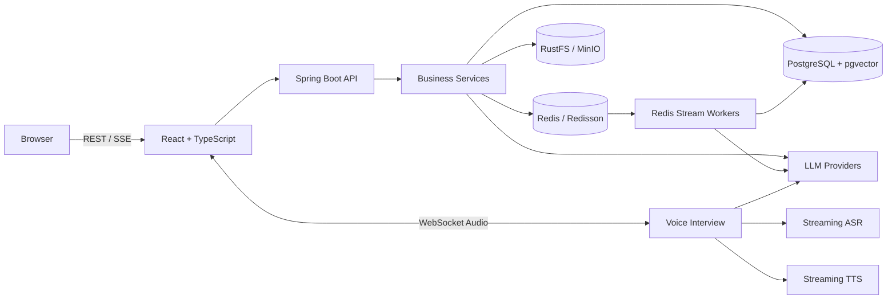

# 智能面试平台（AI Interview Platform）

一个基于 Spring Boot、Spring AI 与 React 的智能面试辅助平台，覆盖简历解析与评估、文字/语音模拟面试、Skill 驱动出题、RAG 知识库问答、面试日程和 PDF 报告导出。

> 本仓库用于个人学习与工程实践，在开源项目 [Snailclimb/interview-guide](https://github.com/Snailclimb/interview-guide) 基础上扩展了 Redis Stream 可观测性与死信重放、图片简历多模态解析等能力。请遵守仓库内的 AGPL-3.0 许可证及原项目版权要求。

## 项目亮点

- **异步任务治理**：以 Redis Stream 统一承载简历分析、文档向量化、智能出题、文字面试评估和语音面试评估 5 类任务，支持 ACK、Pending 认领、最多 3 次重试、死信留存和人工重放。
- **可观测性**：使用 Micrometer 记录入队耗时、队列等待、处理耗时、重试和任务结果，通过 Prometheus Endpoint 暴露指标。
- **结构化输出**：`StructuredOutputInvoker` 统一处理 JSON Schema 校验、本地修复、错误反馈重试和模型降级。
- **RAG 检索**：采用 token-aware 分块、1024 维向量、pgvector HNSW/Cosine 索引，并结合 Query Rewrite、动态 Top-K、相关性过滤和知识库隔离。
- **Skill 驱动出题**：使用 `SKILL.md`、元数据和参考资料描述面试方向，内置 Java、前端、算法、测试、系统设计和 AI Agent 等 10 个方向。
- **图文多模态简历**：可将 PNG、JPEG、WEBP 简历图片与文字指令一并发送给视觉模型，提取结果复用原有 Redis Stream 异步分析链路；该能力默认关闭，需要自行配置支持图像输入的模型。
- **实时语音面试**：通过 WebSocket 串联流式 ASR、LLM 与句子级并发 TTS，支持实时字幕、暂停恢复、断线重连和回声防护。
- **安全与韧性**：提供输入净化、UUID 动态数据边界、模型输出校验、可重复注解限流、任务幂等和分级降级策略。

## 功能模块

### 简历管理

- 支持 PDF、DOC/DOCX、TXT、Markdown 等文档解析。
- 可选 PNG、JPEG、WEBP 图片简历多模态解析。
- 基于内容哈希避免重复上传，使用 Redis Stream 异步生成分析结果。
- 支持查看处理状态、失败重试和 PDF 分析报告导出。

### 模拟面试

- 根据简历、岗位方向、难度和 Skill 配置生成问题。
- 支持多轮追问、历史题目去重和面试阶段时长分配。
- 文字与语音面试复用统一评估引擎：分批评分、二次汇总和降级兜底。
- 支持面试记录、趋势统计和 PDF 报告导出。

### 知识库与 RAG

- 支持多格式文档上传、异步分块和向量化。
- 支持多知识库检索、流式 SSE 回答、会话管理和 Markdown 展示。
- 可从知识库异步生成题目、参考答案、关键点、评分标准和追问。
- 支持题库筛选、编辑、归档、容量校验和知识库专项面试。

### 面试日程与系统设置

- 规则与 AI 双引擎解析面试邀请，提供日/周/月日历及状态流转。
- 支持 DashScope、Kimi、DeepSeek、GLM、LM Studio 等 OpenAI 兼容 Provider。
- 支持默认聊天/向量模型切换、语音服务配置和连通性测试。

## 系统架构



## 技术栈

| 层次 | 技术 |
| --- | --- |
| 后端 | Java 25、Spring Boot 4.1、Spring AI 2.0、Spring MVC、Spring Data JPA、WebSocket、SSE |
| 数据 | PostgreSQL 16、pgvector、Flyway、Redis、Redisson 4.0、Redis Stream |
| AI / 文档 | DashScope / OpenAI 兼容模型、Spring AI Agent Utils、Apache Tika、iText 8 |
| 存储与映射 | RustFS / MinIO、AWS S3 SDK、MapStruct |
| 前端 | React 18、TypeScript 5.6、Vite 5、Tailwind CSS 4、React Router、Recharts |
| 工程化 | Gradle 9、pnpm 10、Docker Compose、Nginx、Micrometer、Prometheus、SpringDoc |
| 测试 | JUnit 5、Mockito、AssertJ、Playwright |

## 核心工程设计

### Redis Stream 与死信重放

长耗时任务先落库并写入 Stream，消费者按 `PENDING -> PROCESSING -> COMPLETED/FAILED` 推进状态。达到重试上限时执行“先写死信、后 ACK”，死信 Stream 用于审计，带 7 天 TTL 的索引用于按 ID 查询和更新重放状态。重放接口以 `deadLetterId` 加分布式锁，系统语义为 **at-least-once + 业务幂等**，不宣称 exactly-once。

详细设计与面试边界见 [Redis Stream 异步指标与死信重放](docs/ASYNC_METRICS_DLQ_GUIDE.md)。

### 结构化输出与统一评估

模型输出经过 Schema 校验、本地 JSON 修复和带错误反馈的重试；仍然失败时按场景执行模型降级或业务兜底。面试评估默认每 8 题分批处理，再进行二次汇总，避免长文本超出上下文限制。

### 图片简历多模态解析

图片上传后先检测真实 MIME 类型，再通过 Spring AI `UserMessage.media(...)` 发送“文字指令 + 图片”。视觉提取结果进入原有文档存储和异步评分链路。当前不自动将扫描版 PDF 转为图片，也不承诺复杂排版下 100% 识别准确。

配置、接口和验证脚本见 [图片简历多模态解析](docs/MULTIMODAL_RESUME_GUIDE.md)。

## 验证结果

以下数据只描述固定测试集或本机隔离实验，不代表生产环境容量：

| 验证项 | 结果 | 边界 |
| --- | ---: | --- |
| 后端回归测试 | 292 项；242 通过、50 条件跳过、0 失败 | 跳过项不计为通过 |
| 新增多模态单元测试 | 4/4 通过 | 未产生真实视觉模型费用 |
| 前端生产构建 | 通过 | 存在非阻断的包体积提示 |
| 合成故障死信捕获 | 100/100 | 本机、单实例、无外部 LLM |
| 合成故障重放恢复 | 100/100 | 仅覆盖固定故障注入路径 |
| 重放到完成 P95 | 24.84 ms | 不包含 LLM、解析或向量化耗时 |

完整实验条件与原始数据见 [异步任务说明](docs/ASYNC_METRICS_DLQ_GUIDE.md) 和 [基准结果](docs/results/dlq-benchmark-2026-09-07.json)。

## 项目结构

```text
.
├── app/                         # Spring Boot 后端
│   └── src/main/
│       ├── java/interview/guide/
│       │   ├── common/          # AI、异步任务、配置、异常、评估、限流
│       │   ├── infrastructure/  # Redis、对象存储、文档解析、PDF 导出
│       │   └── modules/         # 简历、面试、知识库、语音等模块
│       └── resources/
│           ├── prompts/         # StringTemplate Prompt
│           ├── skills/          # 面试 Skill 与参考资料
│           └── scripts/         # Redis Lua 脚本
├── frontend/                    # React 前端
├── docker/                      # 数据库与基础设施初始化
├── docs/                        # 架构、测试和功能说明
├── scripts/                     # 启动、冒烟测试和基准脚本
├── docker-compose.yml           # 完整容器环境
├── docker-compose.dev.yml       # 本地开发依赖
└── .env.example                 # 安全的配置模板
```

## 快速开始

### 环境要求

- 推荐：Docker Desktop / Docker Engine 与 Docker Compose。
- 本地开发：JDK 25、Node.js 18+、pnpm 10+。
- AI 能力：DashScope API Key，或自行配置兼容的模型 Provider。

### Docker Compose 一键启动

1. 创建本地配置文件：

```bash
cp .env.example .env
```

Windows PowerShell：

```powershell
Copy-Item .env.example .env
```

2. 至少替换以下配置：

```dotenv
AI_BAILIAN_API_KEY=your_dashscope_api_key
APP_AI_CONFIG_ENCRYPTION_KEY=replace_with_a_long_random_string
```

3. 构建并启动：

```bash
docker compose up -d --build
```

4. 访问：

| 服务 | 地址 |
| --- | --- |
| 前端 | <http://localhost> |
| 后端 API | <http://localhost:8080> |
| Swagger UI | <http://localhost:8080/swagger-ui.html> |
| OpenAPI | <http://localhost:8080/v3/api-docs> |
| Actuator 健康检查 | <http://localhost:8080/actuator/health> |

停止服务：

```bash
docker compose down
```

> `docker compose down -v` 会删除数据库和对象存储卷，仅在确认不再需要数据时使用。

### 本地开发

1. 启动 PostgreSQL、Redis 与 RustFS：

```bash
docker compose -f docker-compose.dev.yml up -d
```

如果本机端口已被占用，可覆盖宿主机映射：

```powershell
$env:POSTGRES_BIND_PORT='15432'
$env:REDIS_BIND_PORT='16379'
$env:RUSTFS_API_BIND_PORT='19000'
$env:RUSTFS_CONSOLE_BIND_PORT='19001'
docker compose -f docker-compose.dev.yml up -d
```

2. 启动后端：

```bash
./gradlew :app:bootRun
```

Windows：

```powershell
.\gradlew.bat :app:bootRun
```

3. 启动前端：

```bash
cd frontend
pnpm install
pnpm run dev
```

开发地址默认为 <http://localhost:5173>。

### 启用图片简历多模态解析

在 `.env` 中增加：

```dotenv
APP_AI_MULTIMODAL_RESUME_ENABLED=true
APP_AI_MULTIMODAL_RESUME_PROVIDER=dashscope
APP_AI_MULTIMODAL_RESUME_MODEL=qwen3-vl-flash
```

模型必须支持 OpenAI 兼容的图像输入。真实调用可能产生费用。

## 常用命令

```bash
# 后端编译与测试
./gradlew :app:compileJava
./gradlew :app:test --no-daemon

# 前端测试与构建
cd frontend
pnpm run test:interview-history
pnpm run test:question-generation
pnpm run test:interview-capacity
pnpm run test:interview-entry
pnpm run build
```

## 主要接口

| 模块 | 接口前缀 | 说明 |
| --- | --- | --- |
| 简历 | `/api/resumes` | 上传、分析、历史记录、PDF 导出 |
| 文字面试 | `/api/interview` | 会话、题目、作答和评估 |
| 面试 Skill | `/api/interview/skills` | 面试方向与 JD 解析 |
| 知识库 | `/api/knowledgebase` | 上传、向量化、检索与题库生成 |
| RAG 对话 | `/api/rag-chat` | 多轮知识库流式问答 |
| 语音面试 | `/api/voice-interview` | 会话与评估管理 |
| 语音 WebSocket | `/ws/voice-interview/{sessionId}` | 实时音频通信 |
| LLM Provider | `/api/llm-provider` | 模型及语音服务配置 |
| 异步死信管理 | `/api/admin/async/dead-letters` | 查询、统计与重放 |

完整接口以 Swagger 文档为准。

## 安全说明

- `.env`、运行日志、运行时 Provider 配置、API Key 和私钥均已排除在 Git 之外。
- `.env.example` 只包含占位符与本地开发默认值；生产环境必须替换数据库、对象存储和配置加密密钥。
- 如果密钥曾进入 Git 历史，仅删除文件并不足够，应立即轮换密钥并清理历史。
- 死信查询接口会隐藏正文，但 Redis 内部载荷仍可能包含业务数据；生产环境应补充管理员 RBAC、访问控制和敏感字段加密。
- Prompt 过滤和多模态数据边界只能降低风险，不能宣称完全抵御任意越狱或间接注入。

## 当前边界

- 真实模型质量、成本、限流和网络延迟依赖所选 Provider。
- 多模态解析尚未针对固定真实图片集给出准确率指标，扫描版 PDF 也不会自动转图片。
- Redis Stream 与死信索引之间不是跨资源事务，系统采用 at-least-once 语义。
- 异步管理接口目前需要在生产部署前补充完整 RBAC。
- 语音链路在无耳机、弱网和服务端音频中转场景下仍可能出现回声或延迟问题。

## License

本仓库随附 [GNU Affero General Public License v3.0](LICENSE)。使用、修改、部署和分发时，请遵守 AGPL-3.0 及上游项目的许可证和版权要求。
